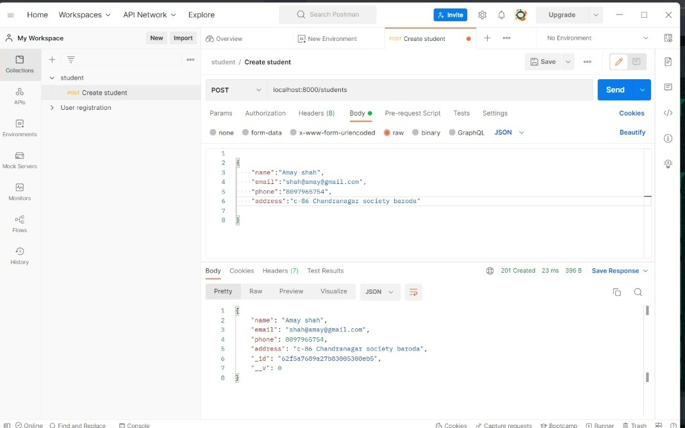
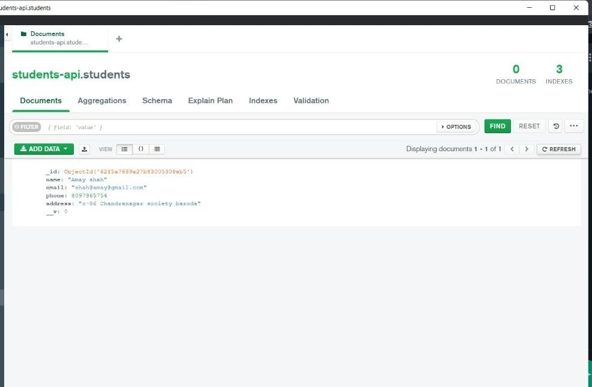

# Student-Api

<h3>Hello guys this is my project "Student-Api" ,where I created student Login Api Using Node.js , Expresss.js , Mongodb and Mongoose and tested it using Postman</h3>

 <h2> Snapshots </h2>

  <h2>Postman Snapshot </h2>
  

<h2>Mongodb-Compass Snapshot</h2>

  
  

